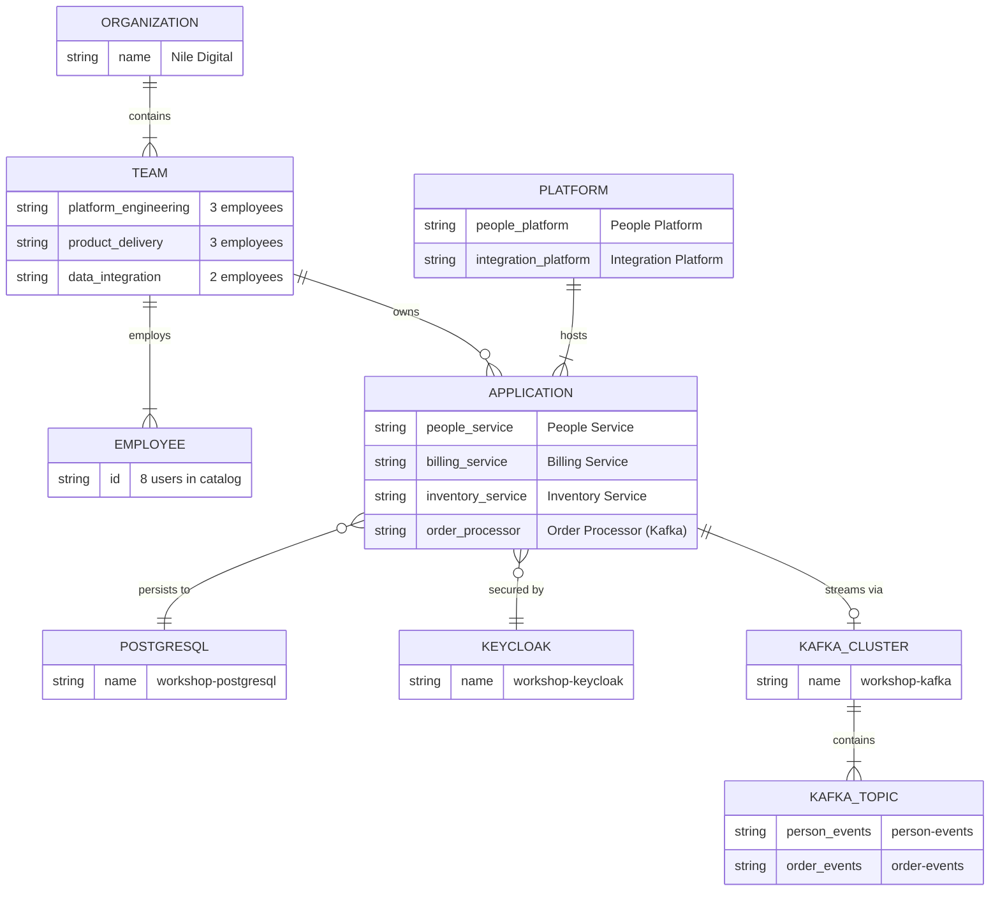
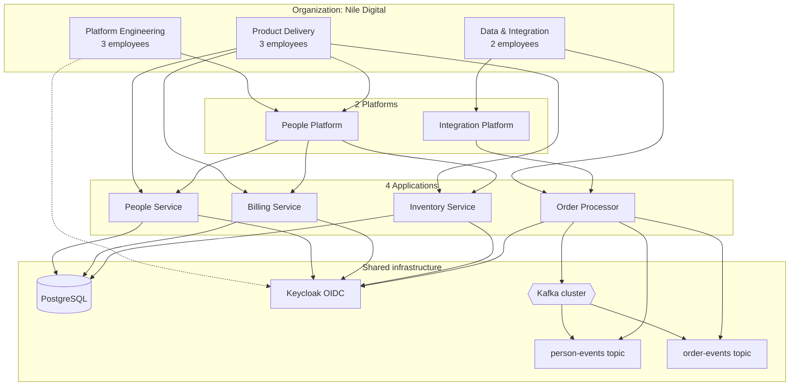
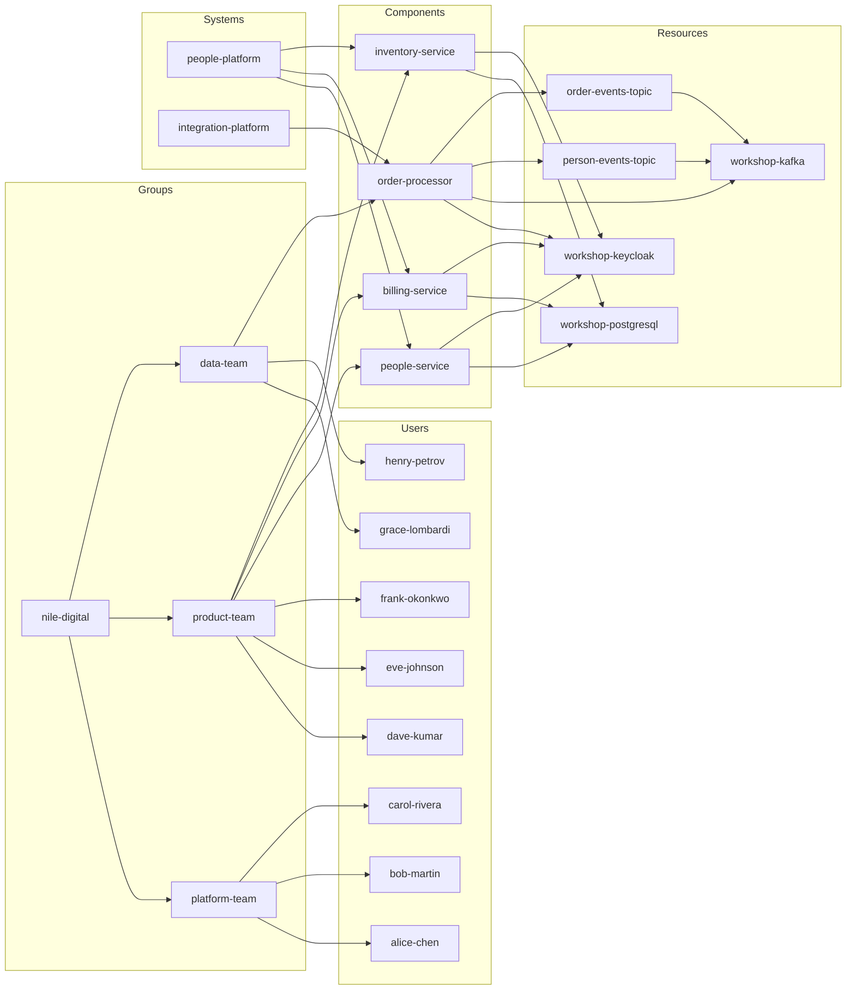

# Organization entity diagram

Model for **Nile Digital**: 3 teams, 8 employees, 2 platforms, 4 applications, PostgreSQL, Keycloak, and Kafka.

## Summary

| Entity type | Count | Names |
|-------------|------:|-------|
| Organization | 1 | Nile Digital |
| Teams | 3 | Platform Engineering, Product Delivery, Data & Integration |
| Employees | 8 | 3 + 3 + 2 across teams |
| Platforms | 2 | People Platform, Integration Platform |
| Applications | 4 | People Service, Billing Service, Inventory Service, Order Processor |
| Database | 1 | Workshop PostgreSQL |
| Identity | 1 | Workshop Keycloak (secures all apps) |
| Kafka | 1 cluster, 2 topics | `person-events`, `order-events` (used by Order Processor) |

## Team membership

| Team | Members |
|------|---------|
| **Platform Engineering** (3) | Alice Chen, Bob Martin, Carol Rivera |
| **Product Delivery** (3) | Dave Kumar, Eve Johnson, Frank Okonkwo |
| **Data & Integration** (2) | Grace Lombardi, Henry Petrov |

## Entity relationship diagram

## Architecture view

## Catalog entity map (Developer Hub)

## Application dependencies

| Application | Platform | Team | PostgreSQL | Keycloak | Kafka | Topics |
|-------------|----------|------|:----------:|:--------:|:-----:|--------|
| People Service | People Platform | Product Delivery | yes | yes | — | — |
| Billing Service | People Platform | Product Delivery | yes | yes | — | — |
| Inventory Service | People Platform | Product Delivery | yes | yes | — | — |
| Order Processor | Integration Platform | Data & Integration | — | yes | yes | `person-events`, `order-events` |

Catalog definitions live in:

- `manifests/gitops/catalog/entities/organization-model.yaml`
- `manifests/gitops/catalog/entities/people-service.yaml` (People Service + People Platform)
